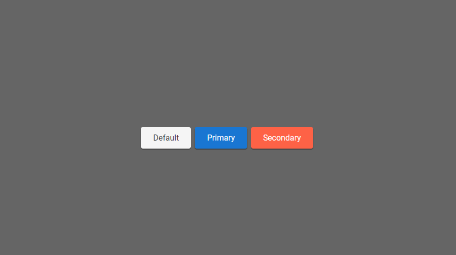

<body style="background-color: #fefefe; color: #333; font-size: 1.2em">

# Ripple Effect

Gif recorded with byzanz-record

Ripple effect made with JavaScript HTML and CSS. Very flexible and complete.

## 🚀 Technologies

- JavaScript
- HTML
- CSS

## ⚠️ How to use

`
Default
`

Just this made a container with a ripple effect.

But you can customize some characters of the ripple effect, like color and size, just do that in styles of your component.

styles.css

`.mycomponent { --wave-color: black; --wave-scale: 10; }`

<b>--wave-color</b> change the color of ripple

<b>--wave-scale</b> change the size of ripple

<body>
